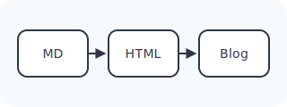

This sample post is intentionally a little strange so the blog builder has to exercise real Markdown parsing instead of happy-path prose.

Here is inline math, $e^{i\pi} + 1 = 0$, mixed into a sentence with CJK text：你好，静态博客！

$$
\int_{0}^{1} x^2\,dx = \frac{1}{3}
$$

## GFM checklist

- [x] Preserve completed tasks.
- [ ] Preserve incomplete tasks with punctuation, emoji-free text, and Unicode: café, naïve, 東京.
- [x] Keep relative links such as [the classic page](../../classic/) and [an external reference](https://example.com/).

## Table with alignment

| Feature | Input | Expected rendering |
| :-- | --: | :--: |
| Math | `$a^2 + b^2 = c^2$` | KaTeX HTML |
| Image | `./assets/edge-diagram.svg` | Relative media path |
| CJK | `段落中的中文` | Unicode-safe text |

## Nested quote and list

> A quoted note can contain structure.
>
> - First quoted bullet
>   1. Ordered child with **bold text**
>   2. Ordered child with `inline code`
> - Second quoted bullet
>
> > A nested quote should remain nested without flattening.

## Code fence containing backticks

````js
const markdown = `Use a fenced block:

```md
# Heading inside a template literal

- item
```
`;

console.log(markdown);
````

## Relative image



Raw HTML that should remain safe after sanitizing: <strong>allowed emphasis</strong> and <span data-fixture="edge">fixture span</span>.
